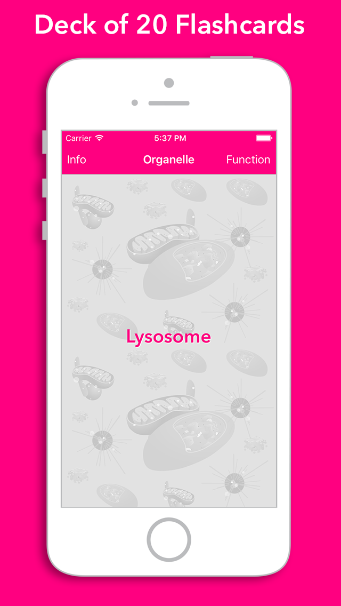
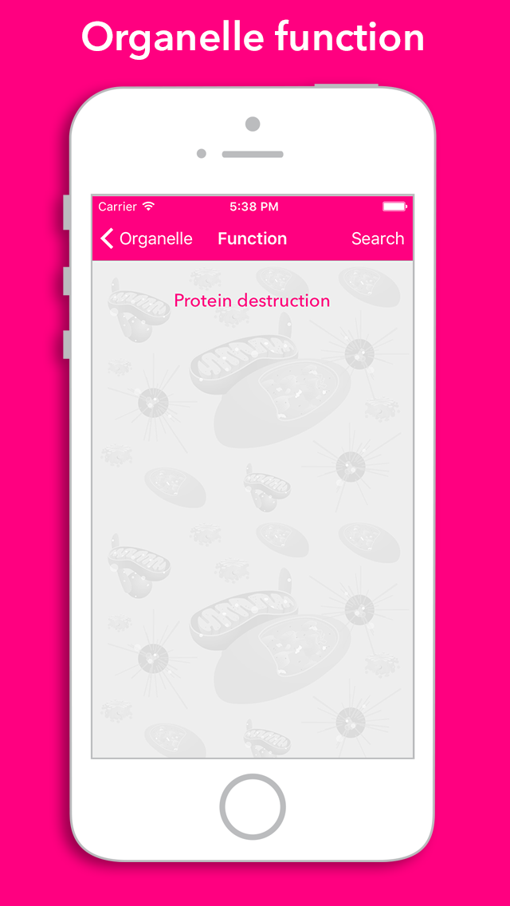

# flashkarte-cellular-organelles
This Swift app contains Cellular Organelle Flashcards that are randomly presented. 
I made this to learn about Swift app development. 
The basic app (before I modified the code) is based on the work of [Yong Bakos](http://yongbakos.com/)

